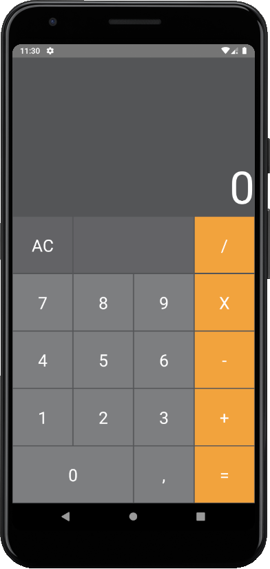

# react-native-calculator

A simple React Native calculator app.

The project was implemented as part of the classes at 
[The State Higher Vocational School In Tarnow](https://pwsztar.edu.pl).




## Installation

```git clone https://github.com/EvilDamage/react-native-calculator.git```

```yarn install/npm install```

## Running

```yarn run android/npm run android```
